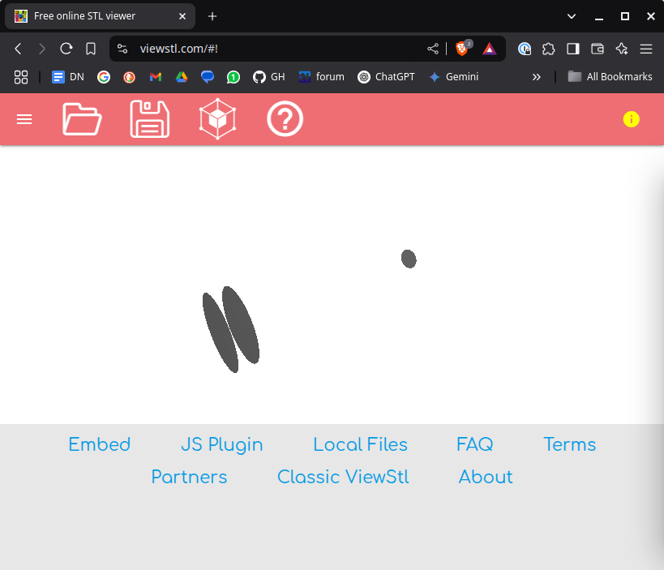

# braille-dot-solenoid-spindle-x1

A simple solenoid spindle designed by ChatGPT4o for a braille dot.
Note: sadly the link below does not have the latest code but it is
in this repo and except for commenting out the `//nalgebra as na;` line
it is identical to the code from the bot:
  * https://chatgpt.com/share/67ae7b08-a2cc-800c-9766-507f51dc01af

This is inspired by conversations I've had with [Xogium](https://xogium.me)
and I hope we can continue to work on this together and have others joining
overtime.

## A little more

Initially the bot chose to use [truck](https://github.com/ricosjp/truck) but
that doesn't work on Linux and it then suggested cadquery_rs. But cadquery_rs
isn't a crate, it hallucinated. I told it there is no cadquery_ry and it then
chose to use nalgebra and stl_io.

So, this compiles and runs on linux generating solenoid_spindle.stl. But when
I view that file using https://viewstl.com it's three disks not a spindle,
see below. I'm guessing the two larger disks are the top and bottom of
the spindle and the smaller disk is the 1 mm hole that is the center of
the spindle. So it seems they haven't been "extruded" and the order isn't
correct, but only a guess!

## Next step

Understand the code and actually generate a spindle.

## License

Licensed under either of

- Apache License, Version 2.0 ([LICENSE-APACHE](LICENSE-APACHE) or http://apache.org/licenses/LICENSE-2.0)
- MIT license ([LICENSE-MIT](LICENSE-MIT) or http://opensource.org/licenses/MIT)

### Contribution

Unless you explicitly state otherwise, any contribution intentionally submitted
for inclusion in the work by you, as defined in the Apache-2.0 license, shall
be dual licensed as above, without any additional terms or conditions.
